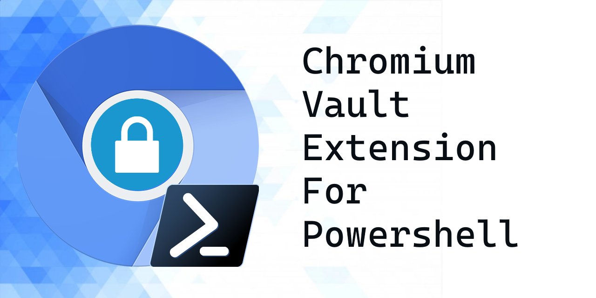

## Overview
This is a Vault Extension for the [Microsoft.Powershell.SecretManagement](https://github.com/powershell/secretmanagement) module. It allows you to quickly detect and access passwords saved in Chromium based browsers such as Google Chrome and Microsoft Edge. You can use credentials saved in the browser to access other resources via Powershell.

## Requirements
- **Powershell 7** (Windows Powershell 5.1 support on the roadmap)
- **Microsoft Windows** (Linux/OSX support on the roadmap)

## Quickstart
```powershell
Install-Module SecretManagement.Chromium
Register-ChromiumVault
Get-SecretInfo
Get-SecretInfo | Out-Gridview -
```
## Features
1. Automatic Discovery of Chrome and Edge (all versions)
1. Fetching secrets, including secrets synced from Android
1. Powerful filter and search syntax

## Get-SecretInfo Filter Usage
Secrets are presented in username|domain format, because usernames can contain @,\, and whitespace symbols, hence the somewhat unusual naming format.
If there is a conflict and two secrets have the same username and URL combination, the database ID of that entry may be appended to the entry with a colon
You can still use this entry to get this specific entry

You can search for secrets in the following ways:

1. User + Domain Explicit Search (`myuser|https://www.twitter.com/`)
1. Explicit URL (`https://www.twitter.com/`). All components, including trailing backspaces, are required!
1. Wildcard URL Search (`*twitter*`)
1. Explcit User search (`myuser|`)
1. Wildcard User Search (`my*|`) - Note the trailing | to indicate you want to search user and not URL 
1. User + Domain Wildcard Search (`*m*|*tw*`)

## FAQ
1. **Why are the secret names so "ugly"?**
   
   Because of a [limitation in the SecretManagement API](https://github.com/PowerShell/SecretManagement/issues/46). If this annoys you, upvote this issue!

1. **This was too easy, I didn't know Chromium was so insecure!**

    It's not insecure per se, your passwords are encrypted at rest by Windows DPAPI and the key is "bound" to your user profile and windows login, so you have to be logged into your profile in order for this to work. Go ahead, try copying the files to another machine or a different user profile on the same machine and try it, it will fail. This is more of a Single Sign-On approach.

    That said, this is also a lesson that any program you run in your userspace can potentially harvest these passwords since it runs in the context of your username, so don't click that email link!